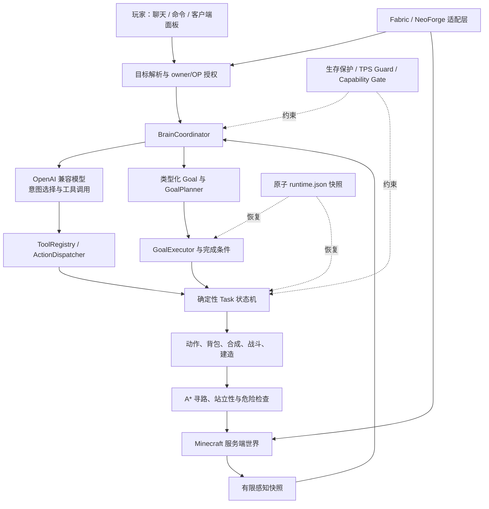

# FakeAiPlayer

> 让一个真正加入 Minecraft 服务端世界的 AI 玩家，像普通玩家一样观察、规划、移动、采集、合成、建造、战斗和生存。

[](https://www.minecraft.net/)
[](https://fabricmc.net/)
[](https://neoforged.net/)
[](https://adoptium.net/)
[](LICENSE)

FakeAiPlayer 是 [`zoyluoblue/mc_aiplayer`](https://github.com/zoyluoblue/mc_aiplayer) 的衍生移植与魔改项目。当前仓库把原 Fabric 单加载器工程重组为 `common + fabric + neoforge` 多加载器结构，并完成项目身份重命名：

| 项目字段 | 当前值 |
|---|---|
| 项目名称 / 模组显示名 | `FakeAiPlayer` |
| 模组 ID | `fakeaiplayer` |
| Java / Maven 域 | `io.github.greytaiwolf.fakeaiplayer` |
| GitHub | `GreyTaiWolf/FakeAiPlayer` |
| 当前版本 | `0.1.0-alpha.1` |
| Minecraft | `1.21.3` |
| Java | `21` |
| 加载器 | Fabric、NeoForge |
| 映射 | Mojang 官方映射 + Parchment `2024.12.07` |
| 许可证 | MIT；上游归属见 [THIRD_PARTY_NOTICES.md](THIRD_PARTY_NOTICES.md) |

> [!IMPORTANT]
> 当前版本仍是 Alpha 开发版，不是生产兼容性认证版。本次移植已经通过双加载器 clean build、68/68 单元测试、Fabric 3/3 GameTest，以及 NeoForge 专用服 `spawn → list → despawn → stop` 烟雾验证；客户端面板、真实客户端网络交互、真实模型调用和复杂地形长时间任务仍需继续验证。请勿把这些基础验证理解为“所有场景已经稳定可用”。

## English summary

FakeAiPlayer is an experimental Minecraft 1.21.3 mod that spawns a real server-side player entity and combines an OpenAI-compatible LLM planner with deterministic in-game task state machines. This fork uses a shared `common` module with Fabric and NeoForge loader adapters. Both loader builds, 68 unit tests, three Fabric GameTests, and a NeoForge dedicated-server bot lifecycle smoke test pass; client, live-provider, and long-running gameplay parity still need validation before a stable release.

## 目录

- [项目目标](#项目目标)
- [当前实现状态](#当前实现状态)
- [它是如何工作的](#它是如何工作的)
- [主要功能](#主要功能)
- [Fabric 与 NeoForge 的区别](#fabric-与-neoforge-的区别)
- [安装](#安装)
- [快速开始](#快速开始)
- [模型与 API Key 配置](#模型与-api-key-配置)
- [完整配置参考](#完整配置参考)
- [指令、聊天与客户端面板](#指令聊天与客户端面板)
- [权限与安全模型](#权限与安全模型)
- [持久化与目录](#持久化与目录)
- [网络协议](#网络协议)
- [源码架构与每个区域](#源码架构与每个区域)
- [构建、开发与测试](#构建开发与测试)
- [从上游 aibot 数据迁移](#从上游-aibot-数据迁移)
- [已知限制](#已知限制)
- [路线图](#路线图)
- [故障排查](#故障排查)
- [许可证与上游归属](#许可证与上游归属)

## 项目目标

FakeAiPlayer 的目标不是让大语言模型每一刻直接控制按键，更不是允许模型任意修改世界。项目采用“模型负责意图，确定性代码负责执行”的边界：

1. 玩家使用聊天、命令或面板表达目标。
2. 服务端收集受限制的世界感知、Bot 状态和记忆。
3. OpenAI 兼容模型从注册工具中选择意图。
4. 类型化 Goal 把大目标拆成可验证步骤。
5. Task 状态机、动作层和寻路器在服务端逐 Tick 执行。
6. 完成条件由后置条件重新检查，而不是只相信模型说“完成了”。
7. 权限、运行模式、生存保护、TPS 保护和持久化围绕执行链提供边界。

项目希望最终做到：

- AI 玩家是真实的服务端 `ServerPlayer` 派生实体，而不是外部 Mineflayer 账号或 Python 鼠标键盘脚本。
- 玩家可以把 AI 当成同伴，用中文或英文交代任务。
- 模型提供商可以通过 OpenAI 兼容的 `chat/completions` + function/tool calling 接口替换。
- Fabric 和 NeoForge 共享同一套核心行为，加载器差异被限制在薄适配层。
- 无 API Key 时，管理员仍可使用确定性的 `/fakeaiplayer task ...` 命令测试核心玩法。
- 默认模式尽量遵守生存规则；需要“作弊式恢复”的能力必须由管理员显式选择。

当前明确不把以下内容冒充为已完成目标：

- 通用人类级 Minecraft 智能；
- 对所有模组方块、配方、GUI 和维度的自动理解；
- 任意 Minecraft 版本或任意 Fabric/NeoForge 版本兼容；
- 每位普通玩家在面板里安全保存自己独立 API Key；
- 所有地形、种子、延迟和服务器规则下 100% 成功。

## 当前实现状态

| 区域 | 当前状态 | 说明 |
|---|---|---|
| 项目重命名 | 已进入源码 | `FakeAiPlayer`、`fakeaiplayer`、`io.github.greytaiwolf.fakeaiplayer` 已用于核心入口、元数据、资源和网络命名空间。 |
| 多加载器布局 | 已进入源码 | 根工程包含 `common`、`fabric`、`neoforge` 三个子项目。 |
| 共享核心 | 已迁入 `common` | AI 实体、脑、目标、任务、动作、寻路、配置、持久化、权限、网络 payload 和客户端 UI 均放在共享模块。 |
| Fabric 接入 | 已构建并通过服务端 GameTest | 包含初始化、生命周期、命令、聊天、断线、payload 和客户端事件接入；生产 JAR 已生成，3/3 无头 GameTest 通过。客户端仍待人工验证。 |
| NeoForge 接入 | 已构建并通过专用服烟雾 | 包含 `@Mod` 入口、事件总线、payload、服务端/客户端传输和按键；专用服已完成启动、Bot 生成/列出/移除及正常停止验证。客户端仍待人工验证。 |
| 自然语言大脑 | 已保留并重命名 | 默认连接 DeepSeek；请求格式为 OpenAI 兼容的非流式 `/v1/chat/completions` 工具调用。 |
| 确定性玩法 | 已保留 | 源码包含 63 个工具定义、9 类类型化 Goal，以及采集、挖矿、合成、冶炼、建造、战斗、农牧等任务状态机。 |
| 客户端面板 | 已迁入共享源码 | 聊天/状态、快捷动作、背包、目标链、设置页面均存在；需要在两个加载器上分别验证渲染与网络。 |
| 单元测试 | 68/68 通过 | `common/src/test` 的 19 个 JUnit 测试类已在 Java 21、Minecraft 1.21.3 / NeoForge 测试运行时执行。 |
| Fabric GameTest | 3/3 通过 | 独立 `gametest` source set 已接线；无头服务端完成方块变更、定时断言和 Goal/MissionSpec 往返测试。测试代码不进入发布 JAR。 |
| 正式发行 | 尚未完成 | 当前没有在本文承诺可用于生产服的稳定二进制发布。 |

判断一个能力是否“完成”时，请区分四个层次：源码存在、能够编译、能够在游戏启动、在真实地形上有重复验证。路线图或源文件出现某个能力，不等于该能力已经达到最后一个层次。

## 它是如何工作的



### 为什么不让 LLM 直接控制每一个 Tick

逐 Tick 远程模型控制会带来高延迟、高费用、不稳定动作、线程阻塞和不可验证的世界修改。FakeAiPlayer 把模型调用放在异步决策层；移动、挖掘、交互和状态机仍由服务器线程中的确定性逻辑执行。旧响应还会通过 decision epoch/lease 检查，降低“玩家已经改令，但较慢的旧 API 响应回来后继续执行”的风险。

### Goal、Task 与 Action 的区别

| 层次 | 回答的问题 | 示例 |
|---|---|---|
| Goal | 最终要证明什么成立？ | “背包中有 3 颗钻石”“完成一套护甲”“建好指定蓝图”。 |
| GoalStep | 为了 Goal 需要哪些依赖步骤？ | 做木镐、升级石镐、找到矿层、采矿、回收掉落。 |
| Task | 一个可以跨多个 Tick 推进、暂停、失败或完成的状态机是什么？ | `GatherQuotaTask`、`StripMineTask`、`BuildTask`。 |
| Action | 具体的一次游戏动作如何执行？ | 看向坐标、选择工具、破坏方块、放置方块、移动物品。 |

类型化 Goal 当前覆盖：物品数量、镐等级、矿石采集、农作物收获、护甲、工作站、囤货、食物和蓝图建造。任务结束后，Goal 后置条件会再次读取世界/背包状态并形成完成、部分完成、失败或取消结果。

## 主要功能

### 真实服务端 AI 玩家

- Bot 以服务端玩家实体加入玩家列表和世界，拥有生命、饥饿、背包、装备、游戏模式、位置和维度。
- 新 Bot 强制使用生存模式；不会因为召唤者处于创造模式就继承创造模式。
- 每位普通玩家最多拥有一个个人 Bot；OP/控制台可以执行更广泛的管理操作。
- Bot 名称、角色、owner UUID、生命、饥饿、背包、记忆和任务运行时可进入持久化快照。

### 自然语言与模型工具调用

- 世界聊天支持 `@Bot名 指令内容`。
- 命令支持 `/fakeaiplayer brain say <Bot名> <内容>`。
- 客户端面板支持聊天输入和回复记录。
- 模型只看到当前开放的工具组；低层工具、记忆工具和协作工具可以按配置或 Bot 运行时选项开关。
- 当前 `ToolRegistry` 注册 63 个工具，覆盖回复、观察/移动、合成、采集、挖矿、目标、容器、战斗、生存、记忆、协作和控制。
- 每次请求限制历史消息、单轮工具调用数和总轮次，并对超时、429 与 5xx 执行有限指数退避。

### 确定性玩法任务

现有任务与动作代码覆盖的主要领域包括：

- 移动、跟随、守点、保持位置、站立性检查和 A* 寻路；
- 普通方块挖掘、矿脉 BFS、分支挖矿、向目标 Y 层下降、工具选择和火把；
- 定额采集、掉落物回收、库存不足时补给；
- 生存配方合成、工作台/熔炉放置、冶炼链；
- 箱子查找、存入、取出、囤货；
- 耕地、播种、收获、持续照料、灌溉、繁殖；
- 进食、睡觉、区域照明、紧急避险和庇护；
- 战斗、低血量撤退、守卫、打猎；
- 钓鱼、挤奶、村民简单交易；
- JSON 蓝图、默认小屋、参数化房屋和建造验收。

这些能力并不意味着每个复杂任务在任何地形都会成功。任务仍会受到距离、区块加载、可见性、工具、材料、游戏规则和当前实现边界影响。

### 感知、记忆和多人协作

- `PerceptionCollector` 以配置半径收集有限数量的方块、实体和物品摘要。
- 严格生存模式会通过可观察世界查询限制隐藏方块扫描。
- 每个 Bot 有键值事实、命名地点、基地、死亡地点和长期目标等记忆。
- `TaskBoard` 支持带 kind、role、参数和 scope 的共享 Job；空闲且角色匹配的 Bot 可以认领。
- 同一 owner 的 Bot 可以通过正常授权链互相发送命令消息；跨 owner 操作会被拒绝。

### 运行时控制和可观察性

- 当前任务与目标支持替换、暂停、恢复、停止和全部取消。
- `TpsGuard` 根据服务器状态延缓高成本继续决策与扫描。
- `BotProfiler`、`ReplayRecorder`、结构化日志和诊断命令用于观察性能和最近决策。
- 日志包含单 Bot 文件、全局文件、按日期/大小轮转、队列溢出计数和 SLF4J 镜像。
- 安全拒绝会进入安全审计日志，即使异步结构化日志尚未启动也尽量保持可观察。

### 客户端控制面板

安装同加载器客户端模组后，可使用：

- `Alt + 0`：打开/关闭聊天与状态面板；
- `Alt + 9`：打开快捷动作面板；
- Minecraft“控制”设置中也会注册两个未默认绑定的 `KeyMapping`，玩家可以自行绑定；
- 状态页：生命、饥饿、坐标、任务状态、进度、模型 token；
- 目标页：目标标题、确定性步骤链和验收结果；
- 背包页：查看 AI 背包/装备，并在 owner 与 AI 之间移动物品；
- 快捷动作：过来、暂停/继续、停止、进食、睡觉、挖掘、合成、冶炼；
- 设置页：低层工具、记忆工具、进度播报，以及 operator 模式允许时的“传送至 AI / 召回 AI”。

面板只是一层客户端入口。所有目标选择、物品移动、设置更新和传送都必须在服务端重新做 owner/OP 与能力校验；客户端按钮是否显示或启用不被视为安全边界。

## Fabric 与 NeoForge 的区别

共享核心不直接依赖 Fabric API 或 NeoForge 事件。两个加载器只负责把平台事件和网络传输转交给 `FakeAiPlayer`。

| 事项 | Fabric | NeoForge |
|---|---|---|
| 子项目 | `fabric` | `neoforge` |
| 入口 | `FakeAiPlayerFabric` / `FakeAiPlayerFabricClient` | `FakeAiPlayerNeoForge` / NeoForge 客户端事件类 |
| 元数据 | `fabric.mod.json` | `META-INF/neoforge.mods.toml` |
| 平台依赖 | Fabric Loader + Fabric API | NeoForge |
| 命令/生命周期 | Fabric API callbacks | NeoForge event bus |
| 聊天捕获 | `ServerMessageEvents` | `ServerChatEvent` |
| Payload | Fabric networking API | NeoForge payload registrar/handler |
| 客户端按键 | Fabric key binding 与 client tick callbacks | NeoForge `RegisterKeyMappingsEvent` 与 client tick event |
| 核心逻辑 | 与 NeoForge 共用 `common` | 与 Fabric 共用 `common` |
| 兼容状态 | 原上游路径的主要参考实现；迁移后仍需重新回归 | 新增移植目标；需要更严格的启动、假玩家连接、Mixin 和网络验证 |

不要同时把 Fabric 版和 NeoForge 版 JAR 放入同一个实例。客户端若要使用面板，客户端与服务端必须选择同一种加载器，并使用匹配的 FakeAiPlayer 版本。

## 安装

### 通用要求

- Minecraft Java Edition `1.21.3`；
- Java `21`；
- 一个支持出站 HTTPS 的服务端环境（仅自然语言功能需要）；
- 在 Fabric 或 NeoForge 中二选一；
- 在测试服和备份世界中先验证 Alpha 版本。

### Fabric

| 组件 | 版本 |
|---|---|
| Minecraft | `1.21.3` |
| Fabric Loader | `0.18.4` 或满足元数据要求的更新兼容版本 |
| Fabric API | `0.114.1+1.21.3` 或满足元数据要求的更新兼容版本 |
| Java | `21` |

将以下内容放入服务端 `mods/`：

1. Fabric 版 FakeAiPlayer JAR；
2. 对应 Minecraft 1.21.3 的 Fabric API。

希望使用图形面板的玩家，也要在自己的 Fabric 客户端安装同版本 FakeAiPlayer 和 Fabric API。只使用 `/fakeaiplayer` 命令或 `@Bot名` 聊天时，客户端面板不是必需条件。

### NeoForge

| 组件 | 版本 |
|---|---|
| Minecraft | `1.21.3` |
| NeoForge | `21.3.96` 为当前开发目标 |
| Java | `21` |

将 NeoForge 版 FakeAiPlayer JAR 放入服务端 `mods/`。希望使用图形面板的玩家，也要在自己的 NeoForge 客户端安装匹配版本。

> [!WARNING]
> NeoForge 是本仓库新增的移植目标。第一次运行应使用专门的测试世界，并重点检查 Bot 生成/退出、服务器停止保存、payload 协商、客户端面板、村民交易 Mixin 和长时间 Tick 稳定性。

### 从源码构建 JAR

```bash
git clone https://github.com/GreyTaiWolf/FakeAiPlayer.git
cd FakeAiPlayer

./gradlew :fabric:build :neoforge:build
```

预期输出目录：

```text
fabric/build/libs/
neoforge/build/libs/
```

归档基础名按 `fakeaiplayer-<loader>-1.21.3` 生成；最终文件名还包含项目版本。不要把 `*-sources.jar` 当作游戏模组安装。

## 快速开始

### 1. 启动一次生成配置

首次启动会在加载器配置目录创建：

```text
config/fakeaiplayer.json
```

### 2. 提供模型密钥

推荐只在启动服务端的进程环境中提供：

```bash
export DEEPSEEK_API_KEY="sk-your-key"
```

Windows PowerShell 当前会话示例：

```powershell
$env:DEEPSEEK_API_KEY = "sk-your-key"
```

然后从同一终端启动服务端。环境变量会覆盖配置对象中的 `deepseek.apiKey`，但不会由加载逻辑主动回写到 `fakeaiplayer.json`。

### 3. 生成个人助手

```mcfunction
/fakeaiplayer spawn Bob
```

带角色生成：

```mcfunction
/fakeaiplayer spawn Bob miner
```

### 4. 与它交流

世界聊天：

```text
@Bob 帮我收集 16 个圆石，然后放进基地附近的箱子
```

或命令：

```mcfunction
/fakeaiplayer brain say Bob 帮我做一把铁镐
```

也可以完全绕过 LLM，直接分配确定性任务：

```mcfunction
/fakeaiplayer task assign Bob mine minecraft:stone 16
/fakeaiplayer task status Bob
```

### 5. 停止或移除

```mcfunction
/fakeaiplayer task pause Bob
/fakeaiplayer task resume Bob
/fakeaiplayer task abort Bob
/fakeaiplayer despawn Bob
```

## 模型与 API Key 配置

### 当前 API 模型

当前实现是服务端级单一模型配置，不是每位玩家独立配置：

- 默认 `baseUrl`：`https://api.deepseek.com`；
- 默认 `model`：`deepseek-chat`；
- 请求地址：规范化后的 `baseUrl + /v1/chat/completions`；
- 鉴权：`Authorization: Bearer <apiKey>`；
- 请求模式：非流式；
- 工具协议：OpenAI 风格 `tools`、`tool_choice=auto` 和 `tool_calls`；
- 429 与 5xx 可按配置重试；
- 模型必须正确支持 function/tool calling，否则自然语言执行链无法可靠工作。

如果 `baseUrl` 以 `/v1` 结尾，客户端会先去掉这个结尾，再拼接 `/v1/chat/completions`。因此常见配置既可写服务根地址，也可写以 `/v1` 结尾的兼容地址。带有其他自定义路径的网关需要自行确认最终 URL。

### API Key 安全建议

1. 优先使用环境变量 `DEEPSEEK_API_KEY`，不要把真实密钥提交到 Git、截图、Issue、日志包或公开整合包。
2. 给此项目使用单独密钥，设置余额/速率上限，并定期轮换。
3. 模型调用发生在服务端；不要把密钥发给普通玩家，也不要要求玩家在公共聊天里输入。
4. `fakeaiplayer.json` 支持 `deepseek.apiKey` 字段，但明文文件方式只适合权限受控的私有测试环境。
5. 提交故障日志前搜索并清理密钥、请求内容、玩家聊天和世界坐标等敏感信息。
6. 任何 OpenAI 兼容反向代理都能看到请求中的聊天历史、感知摘要和工具定义；只连接你信任的 HTTPS 端点。
7. 自然语言请求可能计费。普通确定性命令和 Task 不需要调用模型，可用于无密钥测试。

> [!NOTE]
> “玩家自己在面板接入 API Key”尚未实现。当前所有获准使用自然语言大脑的玩家共享服务端配置的提供商与密钥。未来若加入多租户密钥，不应把原始密钥广播给客户端或其他玩家；需要独立的服务端凭据存储、访问控制、配额和审计设计。

## 完整配置参考

配置文件位置由加载器的 config 目录决定，文件名固定为 `fakeaiplayer.json`。以下示例与当前 `AIBotConfig.defaults()` 对齐：

```json
{
  "profile": "strict_survival",
  "operatorCapabilities": {
    "hiddenBlockScan": true,
    "emergencyTeleport": true,
    "forcedPickup": true,
    "manualTeleport": true
  },
  "deepseek": {
    "apiKey": "",
    "baseUrl": "https://api.deepseek.com",
    "model": "deepseek-chat",
    "maxTokens": 2048,
    "temperature": 0.3,
    "timeoutSeconds": 60,
    "retryCount": 3,
    "retryBackoffMs": 500
  },
  "perception": {
    "radius": 16,
    "maxBlocks": 20,
    "maxEntities": 10,
    "maxItems": 10,
    "includeRawLists": false
  },
  "brain": {
    "maxHistoryMessages": 36,
    "maxToolCallsPerTurn": 6,
    "maxTurnsPerRequest": 12,
    "exposeLowLevelTools": false,
    "enableMemoryTools": true,
    "enableCoordinationTools": false,
    "maxTaskRetries": 3,
    "verboseReports": true
  },
  "watchdog": {
    "stuckWindowTicks": 200
  },
  "logging": {
    "enabled": true,
    "directory": "logs/fakeaiplayer",
    "perBotFile": true,
    "rotation": "daily",
    "maxFileSizeMb": 50,
    "maxBackups": 30,
    "mirrorToSlf4j": true,
    "categories": {
      "LIFECYCLE": "INFO",
      "COMM": "INFO",
      "API": "INFO",
      "ACTION": "INFO",
      "PERCEPTION": "DEBUG",
      "PATH": "DEBUG",
      "TASK": "INFO",
      "DANGER": "INFO",
      "ERROR": "ERROR",
      "CONFIG": "INFO"
    }
  },
  "survival": {
    "hungerEatThreshold": 14,
    "hungerCriticalThreshold": 6
  },
  "combat": {
    "retreatHp": 10,
    "maxEnemiesToFight": 2
  },
  "night": {
    "autoSleep": true,
    "torchLightThreshold": 8
  },
  "mining": {
    "returnWhenFreeSlots": 2,
    "toolDurabilityFloor": 0.1,
    "placeTorches": true
  },
  "goal": {
    "maxPlanDepth": 24,
    "replanOnFailure": true,
    "autoToolFill": true
  },
  "nav": {
    "jumpReach": 1.0,
    "sidleAfter": 12,
    "sidleLimit": 60,
    "hardLimit": 30,
    "lookahead": 4,
    "nodeRetry": 2,
    "sprintMinDist": 3.0,
    "maxSafeFall": 3
  },
  "pickup": {
    "forceRadiusH": 2.75,
    "forceRadiusV": 2.5,
    "sweepRadius": 8.0
  }
}
```

### 顶层运行模式

| 字段 | 默认 | 含义 |
|---|---:|---|
| `profile` | `strict_survival` | `strict_survival` 禁止四项特权能力；`operator` 再按 `operatorCapabilities` 的单项开关决定。 |
| `operatorCapabilities.hiddenBlockScan` | `true` | operator 模式允许读取不可见隐藏方块。strict 下即使为 true 也会被拒绝。 |
| `operatorCapabilities.emergencyTeleport` | `true` | operator 模式允许紧急脱困传送。 |
| `operatorCapabilities.forcedPickup` | `true` | operator 模式允许强制吸取掉落物。 |
| `operatorCapabilities.manualTeleport` | `true` | operator 模式允许面板“传送至 AI / 召回 AI”。 |

`AIBOT_PROFILE=strict_survival` 或 `AIBOT_PROFILE=operator` 会覆盖文件值。未知环境变量或无效文件值会 fail closed 到 `strict_survival`。已有配置文件如果完全没有 `profile` 字段，会为上游兼容暂时解析成 `operator` 并写警告；因此迁移旧配置后务必手动加入明确的 `profile`。

### `deepseek`

| 字段 | 默认 | 含义 |
|---|---:|---|
| `apiKey` | 空 | 服务端模型密钥；环境变量优先。 |
| `baseUrl` | `https://api.deepseek.com` | OpenAI 兼容服务根地址。 |
| `model` | `deepseek-chat` | 发送到 API 的模型名称。 |
| `maxTokens` | `2048` | 单次完成的最大 token。 |
| `temperature` | `0.3` | 模型随机度，是否接受及范围由提供商决定。 |
| `timeoutSeconds` | `60` | 单次 HTTP 请求超时。 |
| `retryCount` | `3` | 首次请求之后的最大重试次数。 |
| `retryBackoffMs` | `500` | 初始退避毫秒数，重试时倍增。 |

### `perception` 与 `brain`

| 字段 | 默认 | 含义 |
|---|---:|---|
| `perception.radius` | `16` | 感知扫描半径。增大它会增加扫描和提示体积。 |
| `perception.maxBlocks` | `20` | 感知摘要中的方块条目上限。 |
| `perception.maxEntities` | `10` | 实体条目上限。 |
| `perception.maxItems` | `10` | 掉落物条目上限。 |
| `perception.includeRawLists` | `false` | 是否把更原始的列表加入感知数据；可能显著增加 token 和隐私暴露。 |
| `brain.maxHistoryMessages` | `36` | 每个 Bot 保留的模型对话历史上限。 |
| `brain.maxToolCallsPerTurn` | `6` | 单个模型响应允许执行的工具调用数。 |
| `brain.maxTurnsPerRequest` | `12` | 一次玩家请求的工具往返轮次上限。 |
| `brain.exposeLowLevelTools` | `false` | 默认是否给模型开放手动移动/破坏/放置等低层工具。 |
| `brain.enableMemoryTools` | `true` | 默认是否开放记忆工具。 |
| `brain.enableCoordinationTools` | `false` | 默认是否开放多 Bot Job/通信工具。 |
| `brain.maxTaskRetries` | `3` | 任务失败后的有限重试预算。 |
| `brain.verboseReports` | `true` | 是否发送更详细的进度报告。 |

### 生存、目标与移动

| 字段 | 默认 | 含义 |
|---|---:|---|
| `watchdog.stuckWindowTicks` | `200` | 判断长时间没有有效进展的观察窗口。 |
| `survival.hungerEatThreshold` | `14` | 低于该饥饿值时考虑进食。 |
| `survival.hungerCriticalThreshold` | `6` | 危急饥饿阈值。 |
| `combat.retreatHp` | `10` | 生命较低时撤退的阈值。 |
| `combat.maxEnemiesToFight` | `2` | 同时愿意处理的敌对目标上限。 |
| `night.autoSleep` | `true` | 是否尝试正常寻找/放置床并睡觉。 |
| `night.torchLightThreshold` | `8` | 区域补光使用的方块光照阈值。 |
| `mining.returnWhenFreeSlots` | `2` | 背包剩余槽位较少时返回/存储。 |
| `mining.toolDurabilityFloor` | `0.10` | 工具耐久比例下限。 |
| `mining.placeTorches` | `true` | 挖矿任务是否尝试放火把。 |
| `goal.maxPlanDepth` | `24` | 依赖规划最大深度。 |
| `goal.replanOnFailure` | `true` | 步骤失败后是否允许重新规划。 |
| `goal.autoToolFill` | `true` | 是否自动补全工具依赖。 |
| `nav.jumpReach` | `1.0` | 跳跃/移动可达性参数。 |
| `nav.sidleAfter` | `12` | 停滞后开始侧移修正的阈值。 |
| `nav.sidleLimit` | `60` | 侧移恢复限制。 |
| `nav.hardLimit` | `30` | 节点执行硬限制。 |
| `nav.lookahead` | `4` | 路径执行前视节点数。 |
| `nav.nodeRetry` | `2` | 节点重试次数。 |
| `nav.sprintMinDist` | `3.0` | 允许冲刺的最小距离。 |
| `nav.maxSafeFall` | `3` | 允许的最大安全落差。 |
| `pickup.forceRadiusH` | `2.75` | operator 强制拾取的水平范围。 |
| `pickup.forceRadiusV` | `2.5` | operator 强制拾取的垂直范围。 |
| `pickup.sweepRadius` | `8.0` | 搜索可拾取物的范围。 |

### `logging`

| 字段 | 默认 | 含义 |
|---|---:|---|
| `enabled` | `true` | 是否启动结构化文件日志。 |
| `directory` | `logs/fakeaiplayer` | 相对于游戏目录的日志目录。 |
| `perBotFile` | `true` | 是否写 `by-bot/<安全化名称>.log`。 |
| `rotation` | `daily` | 当前配置的轮转策略标识。 |
| `maxFileSizeMb` | `50` | 文件大小轮转阈值。 |
| `maxBackups` | `30` | 最大备份数量。 |
| `mirrorToSlf4j` | `true` | INFO 及以上是否镜像到普通服务端日志。 |
| `categories` | 见完整 JSON | 各日志类别的最低级别。 |

## 指令、聊天与客户端面板

所有生产命令根节点已经从上游 `/aibot` 改为：

```mcfunction
/fakeaiplayer
```

命令中的 `<name>` 是 Bot 名；在支持 owner 自动选择的入口里，空名称通常表示当前玩家自己的 Bot。具体 Brigadier 自动补全以当前游戏内命令树为准。

### Bot 生命周期

```mcfunction
/fakeaiplayer spawn <name> [role]
/fakeaiplayer role <name> <role>
/fakeaiplayer despawn <name>
/fakeaiplayer list
```

普通玩家可以生成自己的个人 Bot，但同一玩家只能拥有一个。无玩家来源的控制台生成属于全局管理操作。

### 大脑

```mcfunction
/fakeaiplayer brain status <name>
/fakeaiplayer brain reset <name>
/fakeaiplayer brain manual <name> on|off
/fakeaiplayer brain say <name> <text...>
```

诊断入口（需要相应管理授权，可能调用 API 或制造错误场景）：

```mcfunction
/fakeaiplayer brain validate <name> api-failure
/fakeaiplayer brain validate <name> bad-tool-args
/fakeaiplayer brain validate <name> bad-response
/fakeaiplayer brain validate <name> tps <3..60> <text...>
```

### 确定性任务

常用任务：

```mcfunction
/fakeaiplayer task assign <name> move <x> <y> <z>
/fakeaiplayer task assign <name> forage <count>
/fakeaiplayer task assign <name> attack <entity_type> <count>
/fakeaiplayer task assign <name> mine <block_id> <count>
/fakeaiplayer task assign <name> gather <item_id> <count>
/fakeaiplayer task assign <name> craft <item_id> <count>
/fakeaiplayer task assign <name> eat
/fakeaiplayer task assign <name> sleep
/fakeaiplayer task assign <name> light_area <radius> <max_torches>
```

挖矿和矿脉：

```mcfunction
/fakeaiplayer task assign <name> strip_mine <north|south|east|west> [length] [spacing]
/fakeaiplayer task assign <name> strip_mine <north|south|east|west> <length> <spacing> depot <x> <y> <z>
/fakeaiplayer task assign <name> mine_vein [ore_id]
```

农牧：

```mcfunction
/fakeaiplayer task assign <name> farm <x> <y> <z> <radius> <crop_id> [keep_tending]
/fakeaiplayer task assign <name> harvest <x> <y> <z> <radius> <crop_id>
/fakeaiplayer task assign <name> breed <entity_type> <pairs>
```

容器和囤货：

```mcfunction
/fakeaiplayer task assign <name> deposit all_except_tools
/fakeaiplayer task assign <name> deposit item <item_id> <count>
/fakeaiplayer task assign <name> deposit at <x> <y> <z> all_except_tools
/fakeaiplayer task assign <name> withdraw <item_id> <count>
/fakeaiplayer task assign <name> withdraw at <x> <y> <z> <item_id> <count>
/fakeaiplayer task assign <name> stockpile [include_tools]
```

冶炼和建造：

```mcfunction
/fakeaiplayer task assign <name> smelt <input_item> <output_item> <count>
/fakeaiplayer task assign <name> build <blueprint> <x> <y> <z> [flatten]
/fakeaiplayer task assign <name> build <blueprint> auto_site [flatten]
```

控制和状态：

```mcfunction
/fakeaiplayer task status <name>
/fakeaiplayer task pause <name>
/fakeaiplayer task resume <name>
/fakeaiplayer task abort <name>
```

### 记忆

```mcfunction
/fakeaiplayer memory <name> remember <key> <value...>
/fakeaiplayer memory <name> recall <key>
/fakeaiplayer memory <name> forget <key>
/fakeaiplayer memory <name> mark_place <place>
/fakeaiplayer memory <name> set_base
/fakeaiplayer memory <name> goto_place <place>
/fakeaiplayer memory <name> set_goal <title> <step1|step2|...>
/fakeaiplayer memory <name> advance_goal <result...>
/fakeaiplayer memory <name> goal_status
/fakeaiplayer memory <name> inject
```

### 多 Bot Job

```mcfunction
/fakeaiplayer job post <kind> <role> [params...]
/fakeaiplayer job list
/fakeaiplayer job tell <from_bot> <target_bot> <message...>
/fakeaiplayer job clear
```

Job 有 owner/global scope 和运行时 lease 语义。服务重启时旧进程留下的认领不会被无条件信任；恢复逻辑会重新打开或标记不安全的旧 lease。

### 持久化、观测和管理员诊断

```mcfunction
/fakeaiplayer persist save
/fakeaiplayer persist reload
/fakeaiplayer profile <name>
/fakeaiplayer replay <name> [1..50]
/fakeaiplayer tps
/fakeaiplayer log status
/fakeaiplayer log rotate
/fakeaiplayer log overflow [1..50000]
/fakeaiplayer snapshot [1..24]
/fakeaiplayer deplint <name> <spec...>
```

注意：

- `persist reload` 只会在没有 Bot、活动任务和 Job 时执行，防止把运行中的状态直接替换掉；
- `snapshot` 会扫描隐藏地形并写复现场景，只允许全局管理员，且要求 operator + `hiddenBlockScan`；
- `log overflow` 是压力/诊断命令，会主动向队列注入大量事件，不应在生产高峰随意运行；
- `deplint` 用于检查 Goal 依赖链，支持 `mine_ore`、`item`、`pickaxe`、`armor`、`workstation`、`stockpile` 等 spec。

### 聊天语法

```text
@<Bot名> <消息>
```

示例：

```text
@Bob 跟着我
@Bob 暂停
@Bob 继续刚才的任务
@Bob 帮我做 8 个熟牛肉
```

聊天监听会先做目标 Bot 解析与 `COMMAND` 授权，再把消息交给控制短语路由或模型大脑。没有 `@Bot名` 前缀的普通聊天不会触发 AI。

## 权限与安全模型

### Owner、OP 与控制台

| 发起者 | 默认允许范围 |
|---|---|
| Bot owner | 查看、聊天/命令、背包操作、自己的 Bot 管理操作。 |
| OP（权限等级 2+） | 可操作其他玩家 Bot，并执行全局管理入口。 |
| 可信控制台（权限等级 4） | 全局管理。 |
| 同 owner 的另一个 Bot | 仅允许经过策略的 `COMMAND` 协作，不允许背包/传送/管理。 |
| 跨 owner Bot 或未知发起者 | 拒绝。 |

查找失败和权限失败对普通调用者返回相同的模糊提示，避免通过名字探测不属于自己的 Bot；详细原因写入安全审计日志。

### 运行模式

`strict_survival` 是新安装默认模式。它无条件拒绝：

- `HIDDEN_BLOCK_SCAN`；
- `EMERGENCY_TELEPORT`；
- `FORCED_PICKUP`；
- `MANUAL_TELEPORT`。

`operator` 只是允许管理员进一步选择，并不绕过单项开关。四个能力仍分别由 `operatorCapabilities` 决定。

### 服务端是最终边界

- 面板 C2S payload 不会直接修改世界；服务端先解析目标、复核 owner/OP，再分发动作。
- 背包操作会在服务端复核槽位和实际可移动数量。
- 传送除了权限外还要求 `MANUAL_TELEPORT` 有效，并寻找附近可站立位置。
- S2C 状态订阅每次推送前都会重新检查查看权限；玩家断线或失权后订阅会清理。
- 模型工具也必须通过工具组、授权和能力边界；不要把 prompt 当作安全机制。

此项目仍是 Alpha，网络输入长度/数量边界、请求速率与模型费用滥用需要持续审计。不要直接把未经验证的开发构建部署到不受信任的公开服务器。

## 持久化与目录

以下路径以游戏/服务器工作目录为基准：

| 数据 | 路径 | 说明 |
|---|---|---|
| 主配置 | `config/fakeaiplayer.json` | 模型、模式、感知、脑、日志、生存和寻路参数。 |
| 结构化日志 | `logs/fakeaiplayer/all.log` | 默认全局日志。 |
| 单 Bot 日志 | `logs/fakeaiplayer/by-bot/*.log` | Bot 名会安全化后作为文件名。 |
| 日志归档 | `logs/fakeaiplayer/archive/` | 日期/大小轮转输出。 |
| 世界运行快照 | `<world>/fakeaiplayer/runtime.json` | 版本化的 Bot、任务/目标、暂停状态和 Job 快照。 |
| 旧格式输入 | `<world>/fakeaiplayer/bots.json`、`jobs.json` | 仅当 `runtime.json` 不存在时尝试读取并转换。 |
| 蓝图 | `<gameDir>/blueprints/*.json` | 自定义蓝图；默认小屋会按需写入。 |
| 地形诊断 | 通常为游戏目录相邻的 `reports/snapshot_x_y_z.txt` | `/fakeaiplayer snapshot` 输出。 |

### 保存行为

- 服务端启动时加载并重生 Bot，再恢复目标/任务运行时和 Job；
- 状态变更会触发合并/防抖的异步写；
- 每 6000 server tick 触发一次周期异步保存；
- 服务端停止时执行生命周期保存；
- `runtime.json` 通过临时文件和原子移动尽量避免半写文件；
- 不支持的 schema 或损坏文件会使持久化进入只读保护，避免用空状态覆盖原文件；
- 管理员可用 `/fakeaiplayer persist save` 显式保存。

不要在服务器运行时手工编辑 `runtime.json`。修改前停止服务并保留整个世界目录备份。

### 蓝图

- `small_hut` 和 `hut_5x5` 会在首次使用时生成默认 JSON；
- 自定义蓝图从 `<gameDir>/blueprints/<name>.json` 读取；
- 参数化房屋使用内部名字 `custom:宽x深x高:材质`；
- 展开后的蓝图最多 4096 个方块，超过限制会拒绝；
- 建造命令支持指定锚点、自动选址和可选整平。

## 网络协议

共享模块定义 Mojang `CustomPacketPayload`，加载器适配层分别完成注册与发送。当前命名空间全部为 `fakeaiplayer`：

| ID | 方向 | 用途 |
|---|---|---|
| `fakeaiplayer:subscribe_bot` | C2S | 订阅/取消一个有权查看的 Bot。 |
| `fakeaiplayer:bot_command` | C2S | 面板聊天、移动、挖掘、合成、冶炼、进食、睡觉、暂停、恢复、停止、重置。 |
| `fakeaiplayer:set_option` | C2S | 修改单 Bot 的 manual/memory/reports 运行选项。 |
| `fakeaiplayer:item_move` | C2S | owner 与 Bot 之间移动背包物品。 |
| `fakeaiplayer:teleport` | C2S | operator 能力允许时传送至 AI 或召回 AI。 |
| `fakeaiplayer:bot_snapshot` | S2C | 生命、饥饿、坐标、任务、Goal、token、能力、背包和装备快照。 |
| `fakeaiplayer:bot_chat` | S2C | AI、用户回显和系统面板消息。 |

面板打开时订阅目标，关闭时取消订阅。服务端每 10 tick 最多向有效订阅者推一次快照，物品移动后会立即回推一帧。客户端没有相应 channel 时，聊天/快捷动作的一部分可以回退到普通聊天或 `/fakeaiplayer` 命令；背包拖动、设置和传送需要自定义 payload。

当前协议在解码和执行两层做边界检查：Bot 名称、动作和设置键最长 32 字符，命令参数最长 1024，聊天文本最长 8192；Goal 步骤和能力列表各最多 64 项，背包最多 64 项，装备最多 6 项。列表长度在分配内存前检查，物品 ID 必须是合法 `ResourceLocation`，方向/动作/设置必须在白名单内，槽位、数量和传送模式也会在服务端二次验证。动态 S2C 文本会按同一协议边界截断，避免异常模型输出把客户端踢下线。

这些限制解决的是单包解析与越界问题，不等同于请求频率控制。按玩家的 LLM 请求速率、并发和费用配额仍是公开服务器部署前需要补齐的保护。

任何二次开发新增 payload 时都应同时完成：长度和数量上限、枚举/槽位验证、主线程执行、owner/OP 授权、能力检查、速率限制、加载器两端注册，以及断线清理。

## 源码架构与每个区域

```text
FakeAiPlayer/
├── common/                 # 与加载器无关的共享玩法、网络数据和客户端 UI
│   └── src/
│       ├── main/java/io/github/greytaiwolf/fakeaiplayer/
│       ├── main/resources/
│       └── test/           # JUnit
├── fabric/                 # Fabric 入口、事件、网络和运行配置
│   └── src/gametest/       # 保留的 Fabric GameTest 源码
├── neoforge/               # NeoForge 入口、事件、网络和运行配置
├── buildSrc/               # 多加载器 Gradle 约定插件
├── docs/                   # 运行模式、测试证据、能力矩阵等工程文档
├── scripts/                # 验证、证据、可靠性和持久化脚本
├── reports/                # 基线索引与报告元数据
├── promo/                  # 已重命名的 HTML 模板与无字背景；旧品牌渲染 PNG 已移除，发布前需重新生成
├── build.gradle
├── settings.gradle
└── gradle.properties       # 项目身份与依赖版本的单一入口
```

### `common` 包级职责

| 包 | 职责 | 修改时重点 |
|---|---|---|
| 根包 | `FakeAiPlayer` 共享启动、Tick、命令桥；`AIBotConfig` 配置。 | 不引入具体加载器 API；保持启动幂等。 |
| `action` | 低层移动、挖掘、放置、交互、背包、装备、耕种等动作。 | 所有世界修改必须在服务端线程并有可达/权限前置条件。 |
| `auth` | owner/OP/控制台/同 owner Bot 的纯策略与 Minecraft 适配门。 | 新入口必须选择 VIEW/COMMAND/INVENTORY/TELEPORT/ADMIN 之一。 |
| `brain` | 对话历史、异步 API、工具 schema、工具分发、决策 lease。 | 不在 server tick 同步等待 HTTP；旧响应必须可失效。 |
| `client` | 客户端状态、按键、命令桥、网络处理和面板。 | 客户端状态不可信，权限必须在服务端复核。 |
| `command` | `/fakeaiplayer` 生产命令树。 | 文档、权限 channel 和 Brigadier 参数同步更新。 |
| `coordination` | Job、TaskBoard、空闲 Bot 协调。 | 处理 owner/global scope 与重启后的 stale lease。 |
| `craft` | 配方索引、采集提示、合成/冶炼依赖。 | 兼容动态配方时不能假设只有原版静态表。 |
| `entity` | `AIPlayerEntity` 及 Bot 自身 Tick。 | 假连接、死亡、维度和玩家列表行为是双加载器高风险点。 |
| `goal` | 类型化目标、规划器、执行器、后置条件和结构验收。 | “Task 完成”不能直接等同于“Goal 完成”。 |
| `log` | 结构化日志、异步 writer、分类与诊断。 | 不记录 API Key；安全拒绝不能静默丢失。 |
| `manager` | Bot 生成、索引、角色、owner、恢复和移除。 | 名称/UUID 唯一性、一 owner 一 Bot、服务停止清理。 |
| `memory` | 键值事实、地点、长期目标、知识与 episode。 | 记忆会进入持久化及模型上下文，注意隐私和大小。 |
| `mining` | 矿石识别、矿层/矿脉扫描和工具等级。 | strict 模式不得偷偷读取不可见矿石。 |
| `mixin` | 假玩家连接、玩家列表和交易所需的窄 Mixin。 | 目标签名受 MC/loader 映射影响，必须分别启动验证。 |
| `mode` | strict/operator 配置、能力决策和可观察世界边界。 | 未知/缺失值按兼容规则或 fail closed 处理。 |
| `network` | 共享 payload、服务端订阅与传输接口。 | 长度/数量边界、channel 协商、授权、主线程和速率。 |
| `observe` | TPS、性能统计和最近决策回放。 | 诊断不能反过来拖慢主线程或泄露敏感内容。 |
| `pathfinding` | A*、邻居枚举、成本、危险、站立性与路径执行。 | 落差、液体、门、方块碰撞和缓存失效。 |
| `perception` | 构建给模型的有限世界快照。 | 限制扫描量、token、隐私与 strict 可见性。 |
| `persist` | schema、原子文件、Bot/任务/Job 恢复。 | 先备份；旧 schema、损坏文件、降级都不能覆盖原数据。 |
| `platform` | `PlatformEnvironment` / `PlatformServices` 抽象。 | 只暴露共享核心真正需要的平台能力。 |
| `runtime` | 意图替换、暂停/恢复、执行栈与生命周期事务。 | 保证取消、替换和恢复的 exactly-once 语义。 |
| `task` | 跨 Tick 的确定性任务状态机、生存保护和卡住恢复。 | 每个阶段要有终止条件、取消处理、进度与清理。 |
| `util` | 离线 GameProfile 等小型工具。 | 避免把加载器特定实现重新带回 common。 |

### 加载器适配层

Fabric 与 NeoForge 都需要提供四类接线：

1. `PlatformEnvironment`：游戏目录、配置目录、模组版本和加载器名；
2. `ServerNetworkTransport` / `ClientNetworkTransport`：payload channel 探测和发送；
3. 服务端事件：启动、停止、Tick、命令、聊天、断线；
4. 客户端事件：payload 接收、按键注册、client tick 和系统聊天捕获。

新增第三个加载器时，应先实现这些接口，而不是复制 `common` 业务代码。

### Mixin

两个加载器共享同一组 Mixin Java 类，但各自携带独立的 `fakeaiplayer.mixins.json`。Fabric 配置显式引用 Loom 生成的 `fakeaiplayer.refmap.json`，以便正式 intermediary 产物把 Mojang 映射下的字段/方法名转换正确；NeoForge 配置不引用 Fabric refmap，继续使用其 Mojang/Parchment 运行时重映射链。它们只覆盖无法通过公开 API 完成的窄边界，例如为假玩家连接安装访问器、拦截玩家列表连接建立，以及调用村民交易奖励方法。Mixin 是最容易随 Minecraft 小版本、映射和加载器内部实现变化的区域之一，升级版本时必须逐个验证目标描述符和运行行为。

## 构建、开发与测试

### 开发环境

- JDK 21；
- 使用仓库自带 Gradle Wrapper；
- 首次构建需要访问 Mojang、Fabric、NeoForge、Parchment、Sponge 和 Maven Central 依赖仓库；
- 不要用 IDE 自带的错误 Java 版本运行 Gradle。

检查 Java：

```bash
java -version
./gradlew --version
```

### 常用 Gradle 任务

```bash
# 编译共享核心
./gradlew :common:compileJava

# 分别编译加载器
./gradlew :fabric:compileJava
./gradlew :neoforge:compileJava

# 构建两个发行 JAR
./gradlew :fabric:build :neoforge:build

# 运行共享单元测试
./gradlew :common:test

# 启动隔离的 Fabric 无头 GameTest（当前共 3 项）
./gradlew :fabric:runGameTest

# 开发启动
./gradlew :fabric:runClient
./gradlew :fabric:runServer
./gradlew :neoforge:runClient
./gradlew :neoforge:runServer
```

### 本次移植验证记录

以下结果来自迁移工作树、JDK 21.0.11、Minecraft 1.21.3、Fabric Loader 0.18.4 / Fabric API 0.114.1+1.21.3 和 NeoForge 21.3.96：

| 验证 | 结果 |
|---|---|
| 原上游 Fabric 基线 | 完整 `build` 通过；68 个 JUnit + 3 个 GameTest 全部通过。 |
| 当前多加载器 clean build | `clean :common:test :fabric:build :neoforge:build` 成功。 |
| 当前共享单元测试 | 19 个测试类、68/68 通过。 |
| 当前 Fabric GameTest | 无头服务器正常启动，3/3 通过并正常停止。 |
| 当前 NeoForge 专用服 | 正常识别 `FakeAiPlayer 0.1.0-alpha.1`，Mixin/配置/配方索引成功。 |
| 当前 NeoForge Bot 生命周期 | 控制台实际完成 `spawn PortBot`、`list`、`despawn PortBot`；假连接登录/离开、持久化与 `stop` 清理正常。 |
| 发布 JAR 检查 | 两个二进制 JAR 均含正确 loader 元数据、加载器专属 Mixin 配置、语言资源和许可证；Fabric 另含并引用 refmap；GameTest 类未进入发布包。 |

尚未在本记录中宣称通过：两个加载器的真实客户端面板、客户端到服务端全部 payload 交互、真实 API 提供商调用、村民交易完整流程、重启中途任务恢复、复杂地形长时间稳定性。

### 发布前最低验证矩阵

| 检查 | Fabric | NeoForge |
|---|---:|---:|
| clean compile / build | 必须 | 必须 |
| 专用服务端无客户端类崩溃 | 必须 | 必须 |
| 客户端进入服务器 | 必须 | 必须 |
| `/fakeaiplayer spawn/list/despawn` | 必须 | 必须 |
| `@Bot` 与 `brain say` | 必须 | 必须 |
| 面板打开、订阅、关闭 | 必须 | 必须 |
| 快捷任务、暂停/恢复/停止 | 必须 | 必须 |
| 背包双向移动 | 必须 | 必须 |
| strict 能力拒绝 | 必须 | 必须 |
| operator 单项能力开关 | 必须 | 必须 |
| 保存、完整停止、重启恢复 | 必须 | 必须 |
| 假连接发包/断线不泄漏 | 必须 | 必须 |
| 村民交易与 Mixin | 必须 | 必须 |
| 30 分钟以上 Tick/任务稳定性 | 建议 | 必须 |

### 测试与证据说明

`common/src/test` 保存纯 Java/JUnit 边界测试，包括授权、配置/模式、Goal 结果、任务取消、决策 session、执行栈和原子持久化。`fabric/src/gametest` 保存 3 个世界支持的 GameTest 场景。

当前分支已经重新接好 GameTest source set 和 `:fabric:runGameTest`，仓库中的 `scripts/*.sh`、`docs/*.md` 与 GitHub Actions 也已迁移到模块级任务和 `fabric/build` 运行目录。现有交互式 evidence harness 仍由 Fabric testmod 提供；NeoForge 当前的自动门禁是编译/构建加专用服生命周期烟雾测试，两者不能被解释为相同覆盖率。

严谨的能力结论应带有：精确提交、干净工作树、Java/loader/MC 版本、世界种子、配置、完整日志和可重复步骤。旧 TSV、截图或在脏工作树上通过的运行不能自动证明当前 NeoForge 移植版本。

## 从上游 aibot 数据迁移

上游项目使用 `aibot` 模组 ID、`io.github.zoyluo.aibot` 包、`/aibot` 命令和旧数据目录；FakeAiPlayer 使用新的命名空间。当前代码不会跨目录自动搜索 `<world>/aibot` 或 `config/aibot.json`，因此迁移必须由管理员在离线状态下完成。

### 推荐步骤

1. 完整停止服务器，不要热迁移。
2. 备份服务端、世界目录、`config/`、旧 `logs/aibot/` 和 `blueprints/`。
3. 从 `mods/` 移除上游 `mc_aiplayer` JAR，避免两个模组同时注册假玩家、命令和数据。
4. 安装正确加载器的 FakeAiPlayer JAR。
5. 将旧 `config/aibot.json` 复制为 `config/fakeaiplayer.json`，保留原文件作为备份。
6. 在新配置顶层显式加入 `"profile": "strict_survival"` 或 `"profile": "operator"`。缺失 `profile` 的已有文件会为兼容解析成 operator，可能不是你想要的安全级别。
7. 将 `<world>/aibot/` 复制为 `<world>/fakeaiplayer/`。不要只移动而不保留备份。
8. 如果新目录中只有 `bots.json` 和 `jobs.json`，首次启动会在该新目录内尝试旧格式迁移并写 `runtime.json`；成功后会保留 `.migrated.bak` 备份。
9. `blueprints/` 路径仍在游戏工作目录根部，通常不需要改名，但应检查自定义 JSON。
10. 旧 `logs/aibot/` 不需要导入运行时；可作为历史归档。新日志默认写入 `logs/fakeaiplayer/`。
11. 把自动化、权限插件、命令方块和文档中的 `/aibot` 改为 `/fakeaiplayer`。
12. 在副本世界启动，检查 `logs/latest.log`、`logs/fakeaiplayer/all.log` 和 `<world>/fakeaiplayer/runtime.json`。
13. 依次验证 `list`、Bot owner、背包、位置、角色、记忆、当前 Goal 和 Job，再开放玩家使用。
14. 确认正常后执行 `/fakeaiplayer persist save`，但仍保留迁移前备份至少一个发布周期。

### 不能直接兼容的标识

- 模组 ID：`aibot` → `fakeaiplayer`；
- 命令：`/aibot` → `/fakeaiplayer`；
- payload：`aibot:*` → `fakeaiplayer:*`；
- 资源：`assets/aibot` → `assets/fakeaiplayer`；
- 配置：`aibot.json` → `fakeaiplayer.json`；
- 世界数据目录：`<world>/aibot` → `<world>/fakeaiplayer`；
- 日志默认目录：`logs/aibot` → `logs/fakeaiplayer`；
- Java 包：`io.github.zoyluo.aibot` → `io.github.greytaiwolf.fakeaiplayer`。

环境变量名目前为了脚本兼容仍是 `DEEPSEEK_API_KEY` 和 `AIBOT_PROFILE`，尚未改成 `FAKEAIPLAYER_*`。

## 已知限制

- 当前是 `0.1.0-alpha.1` 移植开发版，尚未声明生产可用。
- Minecraft 目标精确为 1.21.3；不要假设能直接运行于 1.21.1、1.21.4 或更新版本。
- NeoForge 接入是新代码；假玩家连接、payload、Mixin、客户端事件和服务停止路径需要比 Fabric 更充分的验证。
- 当前只有服务器级单一 API 配置，没有玩家独立 API Key、玩家配额、计费归属或安全凭据 UI。
- 兼容端点必须支持 OpenAI 风格的非流式工具调用；只支持文本聊天的模型不能完整驱动工具链。
- 模型可能误解目标、产生无效参数或消耗预算；确定性边界能降低风险，但不能让规划永远正确。
- 长距离导航、复杂洞穴、液体、门、梯子、跨维度、未加载区块和模组方块仍可能导致失败或卡住。
- 配方和物品能力以当前实现认识的原版/运行时配方为主，复杂模组 GUI 与自定义机器没有通用适配。
- 严格生存模式会把一些原本可用传送恢复的场景变成明确失败，这是预期的公平性取舍。
- 大范围感知、原始列表、过多历史和开放低层工具会增加 token、延迟和模型费用。
- 默认蓝图和参数化房屋不是通用建筑语言；展开上限为 4096 方块。
- 客户端面板需要安装匹配模组；纯服务端安装仍可使用命令和 `@Bot` 聊天，但没有自定义 UI、背包点击和设置按钮。
- 上游 `aibot` 目录不会自动跨命名空间发现，必须按迁移章节离线复制。
- Fabric GameTest 已接线并在本次迁移中 3/3 通过；它们仍只是最小确定性场景，不能替代完整任务回归。
- 项目使用 Minecraft 内部行为和少量 Mixin；任何游戏小版本升级都可能破坏目标签名或网络行为。

## 路线图

以下是开发方向，不是发布日期承诺。

### P0：让双加载器移植可验证

- [x] 完成 Fabric 与 NeoForge clean build；
- [x] 完成 Fabric GameTest 服务端和 NeoForge 专用服冒烟；
- [ ] 完成两个加载器的真实客户端、面板和网络交互冒烟；
- [x] 验证假玩家 `Connection`/packet listener 在 NeoForge payload channel 检查下安全工作；
- [x] 验证服务启动、Mixin 应用、Bot 生成/断线与停止清理；
- [ ] 完成村民交易 Mixin 的真实交互回归；
- [x] 检查所有 C2S 字符串、列表、槽位、数量和方向边界；
- [ ] 为模型请求增加服务端玩家级速率/并发/费用保护。

### P1：测试与持续集成

- [x] 重新接通 Fabric GameTest 源集和独立运行任务；
- [ ] 为 NeoForge 建立等价世界测试或专门 harness；
- [x] 在 CI 中构建两个 loader，并检查 JAR 完整性、元数据和测试代码泄漏；
- [x] 将旧脚本从单项目路径更新为多加载器输出；
- [ ] 为网络编码/解码、授权、迁移和损坏快照增加回归测试。

### P2：配置和玩家体验

- 增加安全的服务端 provider/profile 管理，而不是在聊天中粘贴密钥；
- 设计多租户 API Key、配额、加密存储与撤销流程后，再考虑玩家自带 Key；
- 给配置增加 schema/version、范围校验和热重载边界；
- 完成宣传图与演示素材重制；运行时面板、命令和日志文案已切换为 `FakeAiPlayer`，但历史类名保留以控制移植风险；
- 增加正式版本迁移向导和备份检查。

### P3：玩法可靠性

- 改进长距离寻路、区块边界、液体、门/梯子和跨维度任务；
- 扩展结构验收、材料回收和失败恢复；
- 通过多种子、干净提交的证据包重新认证采矿、食物、建造、战斗和囤货能力；
- 建立兼容其他模组配方、方块标签和交互的扩展接口。

## 故障排查

### 模组无法加载：Java 版本错误

症状通常包含 class version、toolchain 或 Java 17/Java 8 提示。

```bash
java -version
./gradlew --version
```

两者都应指向 Java 21。服务端启动脚本也必须使用同一个 JDK。

### Fabric 提示缺少依赖

确认 Minecraft 1.21.3、Fabric Loader 和 Fabric API 版本与安装表一致，并确认没有误装 NeoForge JAR 或 `sources.jar`。

### NeoForge 提示不兼容或在初始化崩溃

确认使用目标 NeoForge 21.3.x 和 Minecraft 1.21.3。保留完整 crash report，重点查看 `FakeAiPlayerNeoForge`、payload 注册、Mixin apply 和假玩家连接栈。Alpha 期间不要靠删除 Mixin 配置“绕过”后继续使用，因为那可能让 Bot 以更隐蔽的方式损坏。

### `/fakeaiplayer` 不存在

- 查看模组列表是否有 `fakeaiplayer`；
- 检查你安装的是发行 JAR 而不是 common/sources JAR；
- 检查服务端日志中的模组初始化错误；
- 不要继续输入旧 `/aibot`。

### Bot 生成失败

- 名称是否已被真实玩家或另一个 Bot 使用；
- 当前玩家是否已经拥有一个个人 Bot；
- 生成位置是否安全；
- 查看 `bot_spawned`、`bot_spawn_position_unsafe` 或连接/Mixin 异常。

### `@Bob` 没反应

- 消息必须包含 `@Bob` 加空格和正文；Bot 名由正则 `\w+` 匹配，复杂字符名可能不适用；
- 确认发送者是 owner 或 OP；
- 确认 `DEEPSEEK_API_KEY` 已进入服务端进程，而不是只设置在另一个终端；
- 检查 `logs/fakeaiplayer/all.log` 中 `deepseek_key_missing`、`auth_error`、`rate_limited`、`api_timeout`、`bad_response`；
- 无密钥时先用 `/fakeaiplayer task assign ...` 验证 Bot 核心。

### API 返回 404

核对 `baseUrl`。代码最终调用 `/v1/chat/completions`；如果代理要求其他路径，需要调整代理或代码。不要把完整 `/chat/completions` 再填入 `baseUrl`。

### API 返回 401/403

检查密钥、服务商账户和模型权限。不要把密钥粘贴到 Issue。轮换可能泄露的密钥后再继续。

### API 返回 429 或费用过高

当前会有限重试 429。降低使用频率、`maxTokens`、历史长度、感知原始列表和开放工具数量，并在服务商侧设置额度。公开服务器在没有速率限制补强前不应开放无限自然语言调用。

### 面板打不开或一直等待数据

- 客户端和服务端是否都安装同 loader、同版本 FakeAiPlayer；
- Fabric 客户端是否有 Fabric API；
- 尝试 `Alt+0` / `Alt+9`，也检查 Minecraft 控制设置中的按键；
- 确认玩家拥有目标 Bot 或是 OP；
- 用命令检查 `/fakeaiplayer list` 和 `/fakeaiplayer task status <name>`；
- 查看网络 channel/payload 注册错误。

### 传送按钮不可用

这是默认行为。需要同时满足：

1. `profile` 为 `operator`；
2. `operatorCapabilities.manualTeleport` 为 `true`；
3. 当前玩家对该 Bot 有 TELEPORT 权限。

严格生存模式下按钮必须保持禁用，服务端也会拒绝伪造 payload。

### 重启后 Bot 没恢复

- 检查 `<world>/fakeaiplayer/runtime.json` 是否存在；
- 检查 schema unsupported、malformed、dimension missing 和 inventory restore 日志；
- 若文件损坏，先复制备份再修复/移走，切勿让空状态覆盖唯一副本；
- 若从上游迁移，确认数据已经复制到新的 `fakeaiplayer` 目录，而不是仍在 `<world>/aibot`。

### 持久化 reload 被拒绝

这是保护机制。先停止并移除 Bot 的活动工作、despawn 所有 Bot，并清空 Job，再执行 reload。生产服更推荐完整停止后恢复备份。

### Bot 卡住或任务失败

- 查看 `/fakeaiplayer task status <name>`、`profile <name>`、`replay <name>`；
- 检查材料、工具耐久、背包空间、目标区块是否加载、路径是否被门/液体/落差阻挡；
- 先 `pause`，必要时 `abort` 或 `brain reset`；
- strict 模式下确认失败是否来自被正确拒绝的特权恢复，而不是程序异常；
- 提交复现时包含版本、loader、种子、坐标、配置（去除密钥）、任务命令和脱敏日志。

## 许可证与上游归属

本仓库基于 zoyluo 的开源项目 [`zoyluoblue/mc_aiplayer`](https://github.com/zoyluoblue/mc_aiplayer) 进行移植和修改，导入基线提交为 `8f0621ade1059c62fb866a01a39a418aa98895a2`。上游以 MIT License 发布，原始版权声明必须保留。

- 根许可证：[LICENSE](LICENSE)
- 第三方与上游声明：[THIRD_PARTY_NOTICES.md](THIRD_PARTY_NOTICES.md)
- 当前项目仓库：<https://github.com/GreyTaiWolf/FakeAiPlayer>
- 上游项目仓库：<https://github.com/zoyluoblue/mc_aiplayer>

FakeAiPlayer 与 Mojang Studios、Microsoft、Fabric、NeoForge、DeepSeek 或其他模型提供商没有官方隶属或背书关系。Minecraft 名称、资源和商标归其各自权利人所有。

贡献代码前，请确保你有权以仓库许可证提交，并保留上游 MIT 版权和许可文本。分发修改版时，应一并分发 `LICENSE` 与 `THIRD_PARTY_NOTICES.md`。
